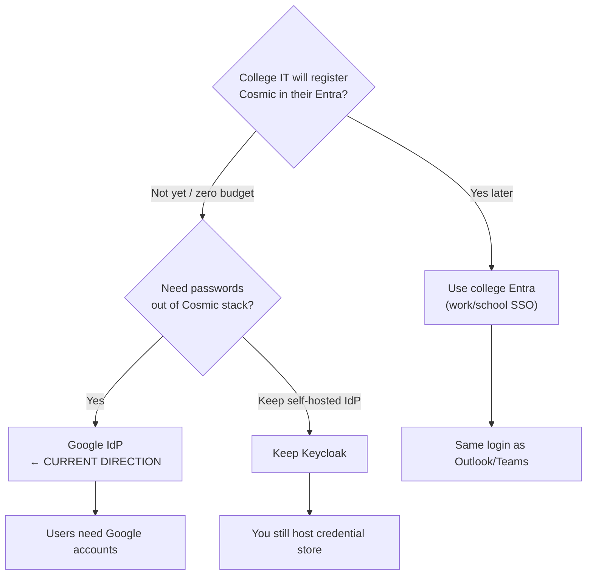
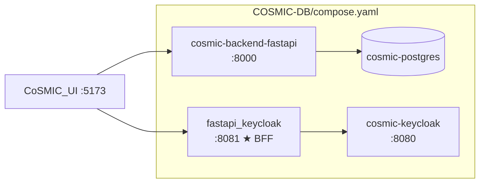
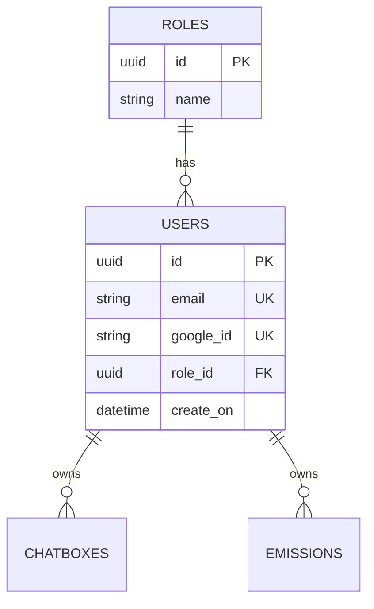
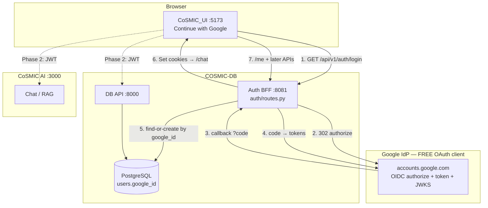
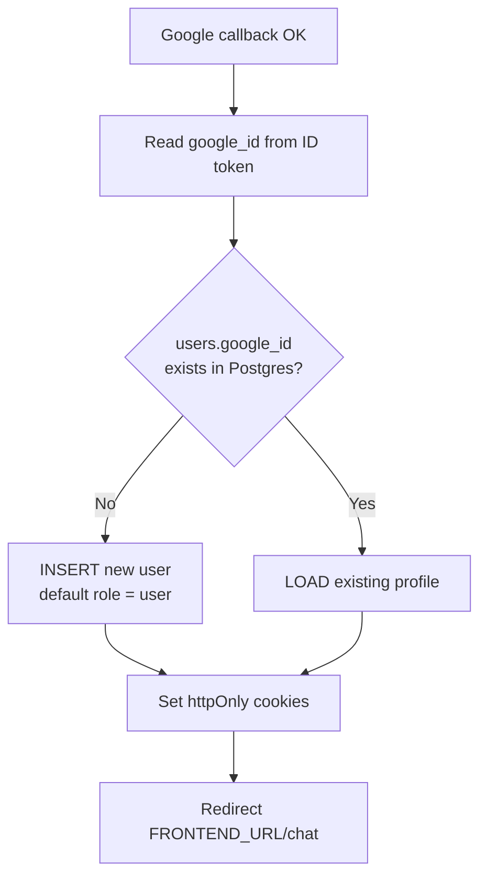
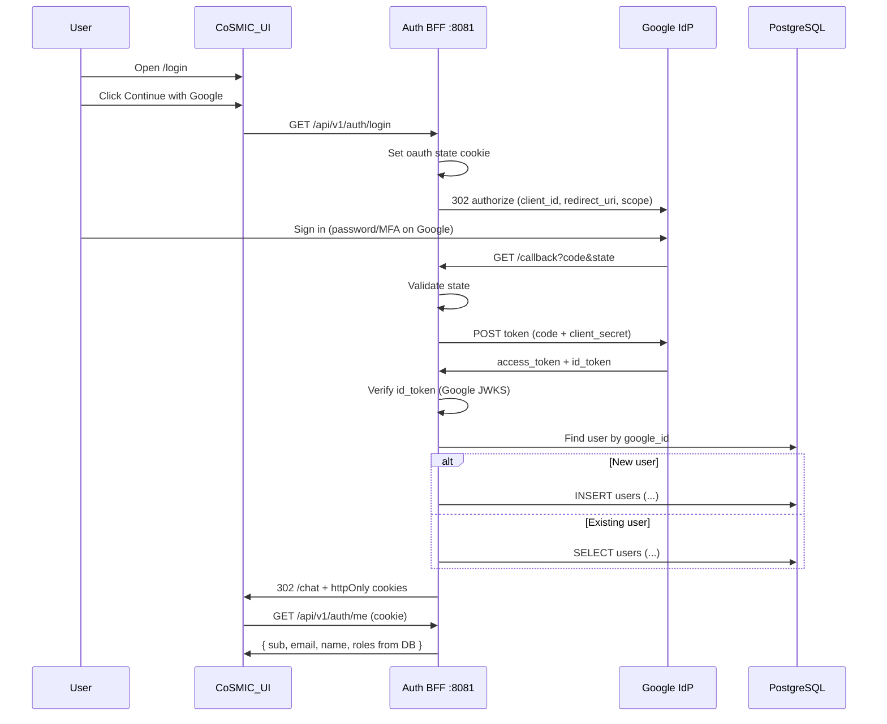
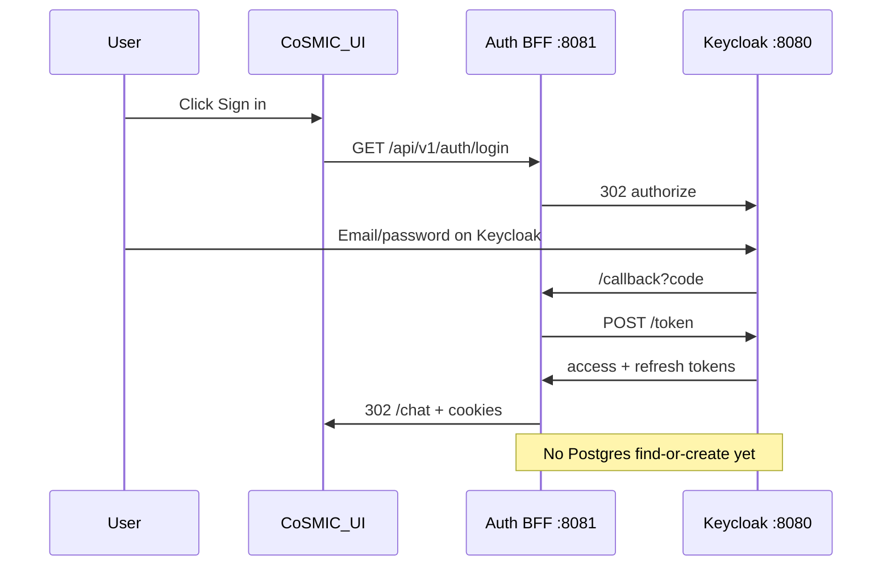
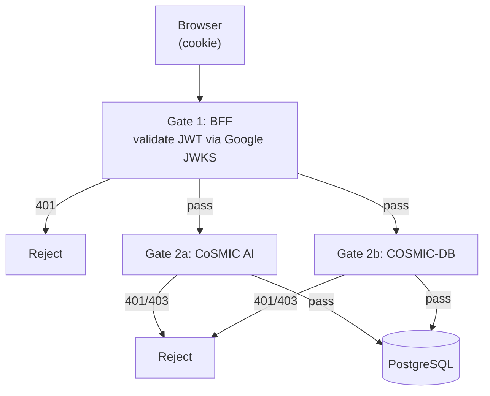
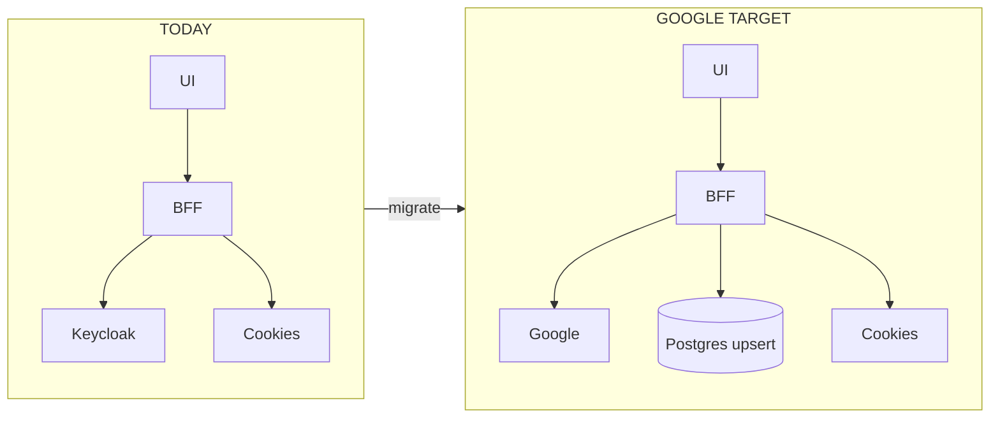
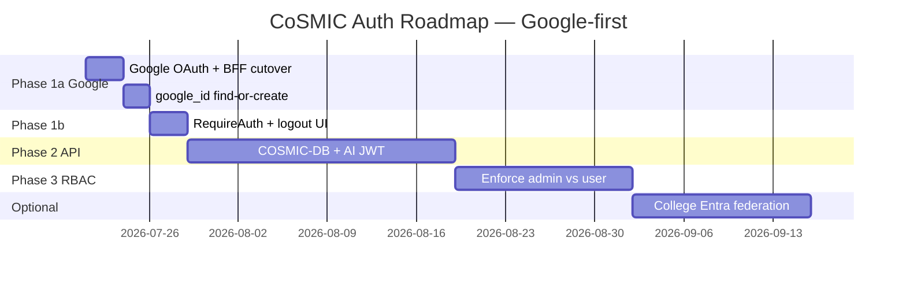

# CoSMIC — SSO (OAuth2/OIDC) & RBAC Implementation Roadmap

High-level plan for **authentication** (SSO via OAuth2/OIDC) and **authorization** (RBAC) on the CoSMIC platform.

| Field | Value |
| ----- | ----- |
| **Direction (as of now)** | **Google IdP** (“Sign in with Google”) — free OAuth client; **no passwords in Cosmic code/DB** |
| **Current runtime IdP** | **Keycloak** (still in `COSMIC-DB` compose) — Phase 1 SSO works against Keycloak |
| **Last updated** | 2026-07-21 |

**Recommended pattern (target):** Google OIDC + BFF in `COSMIC-DB/auth/` with httpOnly cookies + find-or-create `users` row by `google_id` + JWT validation on every downstream API.

---

## Table of contents

1. [IdP decision: Google vs Entra vs Keycloak](#1-idp-decision-google-vs-entra-vs-keycloak)
2. [COSMIC-DB repo map](#2-cosmic-db-repo-map)
3. [Current status (what runs today)](#3-current-status-what-runs-today)
4. [Target: Google IdP architecture](#4-target-google-idp-architecture)
5. [Find-or-create user (login vs registration)](#5-find-or-create-user-login-vs-registration)
6. [Workflows & graphs](#6-workflows--graphs)
7. [Keycloak → Google: what changes](#7-keycloak--google-what-changes)
8. [Phased roadmap](#8-phased-roadmap)
9. [Build vs already have](#9-build-vs-already-have)
10. [Suggested tickets](#10-suggested-tickets)
11. [Summary](#11-summary)
12. [Viewing this doc](#12-viewing-this-doc)

---

## 1. IdP decision: Google vs Entra vs Keycloak

### 1.1 Who owns passwords?

| Store | Passwords? |
| ----- | ---------- |
| Cosmic git / committed `.env` | **Never** (secrets in env/secret manager only) |
| Postgres `users` | **Never** — profile + `google_id` / `oidc_sub` only |
| Google (target) | Google owns password / MFA |
| College Entra (optional later) | Microsoft owns password / MFA |
| Separate Entra External ID for Cosmic | Microsoft owns password / MFA |
| Keycloak (current) | Keycloak stores local user credentials (dev) |

### 1.2 Cost comparison (Cosmic-relevant)

| Piece | Google “Sign in with Google” | College Entra ID (work/school) | Separate Entra External ID (Cosmic’s own CIAM) | Keycloak (current) |
| ----- | ---------------------------- | ------------------------------ | --------------------------------------------- | ------------------ |
| **What Cosmic pays for login** | Generally **$0** (OAuth client) | Generally **$0** extra — app registration in **existing** college tenant | **Free** core for first **~50,000 MAU**, then ~**$0.03/MAU** | **$0** (self-host); you pay infra/CPU |
| **Azure subscription** | Not required | College already has one | **Required** (billing linked) | N/A |
| **Risk of surprise charges** | Low for standard login | Low for basic org SSO | **Higher** — SMS/M2M/premium add-ons are **not** in free tier | Ops/hosting only |
| **Setup complexity** | Low–medium | Medium (needs college IT) | **High** | Medium (you already did Phase 1) |
| **Fits campus Outlook/Teams users** | Poor (needs Google accounts) | **Best** | No — Cosmic users ≠ college accounts | Only if you create Keycloak users |
| **Zero-budget solo/dev** | **Safest** | Blocked until college approves app | Possible under 50k MAU if careful | Works offline |

**Practical Cosmic takeaway**

- **Now (zero-budget / no college IT yet):** adopt **Google IdP** — free, simple, no passwords in Cosmic.
- **Later (college officials/students on Outlook/Teams):** prefer **college Entra app registration** (reuse campus IdP; not a separate Cosmic External ID bill).
- **Separate Entra External ID for Cosmic alone:** not required; can stay free under 50k MAU but is easier to misconfigure into paid add-ons than Google.

### 1.3 Decision matrix



---

## 2. COSMIC-DB repo map

Auth BFF and Keycloak live in **COSMIC-DB** (not `CoSMIC_UI/backend/` — that path is stale).

### 2.1 Directory map (auth-relevant)

```
COSMIC-DB/
├── compose.yaml                          # postgres, fastapi API :8000, keycloak :8080, fastapi_keycloak :8081
├── .env                                  # KC admin + DB secrets (do not commit secrets to public remotes)
├── auth/                                 # ★ Auth BFF (Gate 1) — KEEP when switching IdP
│   ├── __init__.py
│   ├── main.py                           # FastAPI app, CORS, mounts auth router
│   ├── config.py                         # KEYCLOAK_* today → GOOGLE_* target
│   └── routes.py                         # /login, /callback, /logout, /me
├── docker/
│   ├── keycloak/
│   │   └── cosmic-realm.json             # Realm import (REMOVE if Google-only)
│   └── dockerfiles/
│       └── fastapi-keycloak.Dockerfile   # BFF image (rename later to fastapi-auth)
├── apis/
│   ├── table_models/
│   │   ├── users.py                      # users: id, email, role_id — NO password; add google_id
│   │   ├── roles.py                      # admin / user roles
│   │   ├── chatboxes.py                  # FK → users.id
│   │   └── emissions.py                  # FK → users.id
│   └── data_models/users.py              # Pydantic / API shapes
├── routers/api_endpoints/
│   ├── users.py                          # CRUD — still unauthenticated
│   └── roles.py                          # CRUD — still unauthenticated
├── cores/api.py                          # Mounts :8000 routers
└── pyproject.toml                        # httpx, pyjwt[crypto] for auth BFF
```

### 2.2 Services in compose (today)



| Service | Container | Port | Role after Google migration |
| ------- | --------- | ---- | --------------------------- |
| Postgres | `cosmic-postgres` | internal / published | Unchanged — store `users.google_id` |
| DB API | `cosmic-backend-fastapi` | `:8000` | Unchanged now; later JWT + RBAC |
| Keycloak | `cosmic-keycloak` | `:8080` | **Remove** when Google-only |
| Auth BFF | `fastapi_keycloak` | `:8081` | **Keep** — retarget to Google |

### 2.3 Users table (today → Google target)

**Today** (`apis/table_models/users.py`): `id`, `email` (unique), `role_id`, `create_on` — **no password column**.

**Target columns for Google SSO:**

| Column | Purpose |
| ------ | ------- |
| `id` | Cosmic UUID (app primary key) |
| `email` | From Google profile (unique) |
| `google_id` | Google OIDC `sub` — **stable identity key** (unique) |
| `name` | Display name (optional; may live in base model / extend) |
| `role_id` | FK → `roles` — Cosmic RBAC source of truth (Google has no `realm_access.roles`) |
| `create_on` | First registration timestamp |



**Rule:** Google proves identity. Postgres stores **app profile + role**. Never store Google passwords.

### 2.4 Auth routes today (`auth/routes.py`)

| Method | Path | Today (Keycloak) | Target (Google) |
| ------ | ---- | ---------------- | --------------- |
| `GET` | `/api/v1/auth/login` | 302 → Keycloak authorize | 302 → Google authorize |
| `GET` | `/api/v1/auth/callback` | Code → Keycloak token; set cookies | Code → Google token; set cookies; **find-or-create user** |
| `POST` | `/api/v1/auth/logout` | Keycloak logout + clear cookies | Clear Cosmic cookies (+ optional Google logout URL) |
| `GET` | `/api/v1/auth/me` | Decode JWT via Keycloak JWKS; return `realm_access.roles` | Decode via Google JWKS; return Cosmic user + **DB role** |
| `GET` | `/health` | OK | Unchanged |

Cookies (unchanged names): `cosmic_access_token`, `cosmic_refresh_token`, `cosmic_oauth_state`.

---

## 3. Current status (what runs today)

### 3.1 Implementation progress

| Component | Repo / path | Status | Notes |
| --------- | ----------- | ------ | ----- |
| **Keycloak** | `COSMIC-DB` compose | **Running** | Realm `cosmic`, client `cosmic-fastapi-keycloak`, roles `admin`/`user` |
| **Realm import** | `docker/keycloak/cosmic-realm.json` | Done | Auto-import on start |
| **Auth BFF** | `COSMIC-DB/auth/` on `:8081` | **Done** | Not under `CoSMIC_UI/backend/` |
| **BFF routes** | `auth/routes.py` | Done | `/api/v1/auth/login\|callback\|logout\|me` |
| **LoginPage** | `CoSMIC_UI/.../LoginPage.tsx` | Done | “Sign in” → BFF → Keycloak |
| **Auth API** | `CoSMIC_UI/src/api/auth.ts` | Done | Still references `VITE_KEYCLOAK_*` for register link |
| **AuthStore** | `AuthStore.ts` | Done | Session from BFF `/me` |
| **RequireAuth** | `RequireAuth.tsx` | Built | **Commented out** in `App.tsx` — routes currently public |
| **Google IdP** | — | **Not started** | No `GOOGLE_*` env, no `google_id` column |
| **`google_id` / find-or-create** | Postgres | **Not started** | Keycloak `sub` not linked to `users` either |
| **JWT on `:8000` / `:3000`** | — | **Not started** | APIs open |
| **RBAC enforcement** | — | **Not started** | Roles exist in DB only |

### 3.2 Keycloak status in this repo (honest snapshot)

| Item | Status |
| ---- | ------ |
| Docker service + volume | Present and used for Phase 1 SSO |
| Local password accounts | Yes — users register/login **on Keycloak** |
| Passwords in Cosmic DB | No |
| Passwords in Cosmic git | Only dev secrets in env (Keycloak admin / client secret) — should not be treated as production IdP secrets |
| Planned end state | **Remove Keycloak** when Google IdP is wired and verified |

### 3.3 Service layout (current)

```
COSMIC-DB/compose.yaml              CoSMIC_UI/compose.yaml
├── cosmic-postgres                 └── cosmic-react (:5173)
├── cosmic-backend-fastapi (:8000)
├── cosmic-pgadmin
├── cosmic-keycloak (:8080)         ← REMOVE for Google-only
└── fastapi_keycloak (:8081)        ← KEEP; retarget to Google
        network: cosmic_net
```

### 3.4 Login flow (working today — Keycloak)

```
User → /login → Sign in
  → BFF GET /api/v1/auth/login
  → Keycloak login (cosmic realm)  ← password typed HERE
  → BFF GET /api/v1/auth/callback (httpOnly cookies)
  → React /chat
  → GET /api/v1/auth/me (cookie)
```

---

## 4. Target: Google IdP architecture

### 4.1 Who owns what

| Role | Owner |
| ---- | ----- |
| Login UI, password, MFA, Google account | **Google** |
| OAuth client_id / secret / redirect URI | **You** (Google Cloud Console → env) |
| Redirect, code exchange, cookies, `/me` | **COSMIC-DB/auth BFF** |
| “Continue with Google” button | **CoSMIC_UI** → BFF `/login` |
| App user row + Cosmic roles | **Postgres `users` / `roles`** |

### 4.2 Target topology



### 4.3 Env vars (target)

| Variable | Where | Purpose |
| -------- | ----- | ------- |
| `GOOGLE_CLIENT_ID` | BFF | OAuth client |
| `GOOGLE_CLIENT_SECRET` | BFF | Code exchange (secret manager; never commit) |
| `AUTH_PUBLIC_URL` | BFF | e.g. `http://localhost:8081` |
| `FRONTEND_URL` | BFF | e.g. `http://localhost:5173` |
| `VITE_BFF_URL` | UI | Points at BFF |
| ~~`KEYCLOAK_*`~~ / ~~`VITE_KEYCLOAK_*`~~ | — | **Remove** after cutover |

**Google redirect URI:** `http://localhost:8081/api/v1/auth/callback` (prod: `https://<auth-host>/api/v1/auth/callback`).

---

## 5. Find-or-create user (login vs registration)

Google does **not** call separate Cosmic “register” vs “login” APIs. After a successful Google callback, **your code** decides:

```
google_id = id_token.sub   # or userinfo.sub

SELECT * FROM users WHERE google_id = ?

IF NO ROW:
    INSERT users (google_id, email, name, role_id=default_user)   → Registration
ELSE:
    use existing row                                           → Login

THEN set session cookies and redirect to /chat
```



| Outcome | DB action | User experience |
| ------- | --------- | --------------- |
| First Google login | **Registration** — insert row | Lands on `/chat` as new Cosmic user |
| Later Google login | **Login** — no insert | Same Cosmic profile / role / chat history |

`RegisterPage` / Keycloak registration URL become unnecessary for Google-only: account creation happens on Google; Cosmic only upserts the profile.

---

## 6. Workflows & graphs

### 6.1 End-to-end Google login (target)



### 6.2 Frontend-only session check (target)

```
1. React starts
        |
        v
2. RequireAuth (re-enable in App.tsx):
        "Is this user logged in?"
        |
        v
3. GET {VITE_BFF_URL}/api/v1/auth/me  (credentials: include)
        |
        +---- 401 → redirect /login
        |
        v
4. 200 → render /chat or /admin
```

### 6.3 FE click → Google → back to Cosmic (ASCII)

```
User clicks "Continue with Google"
        |
        v
React → GET localhost:8081/api/v1/auth/login
        |
        v
BFF → 302 accounts.google.com/.../auth
        |
        v
User signs in on Google (not in Cosmic)
        |
        v
Google → GET localhost:8081/api/v1/auth/callback?code&state
        |
        v
BFF exchanges code → verifies token
        |
        v
BFF: Does google_id exist in DB?
        |--- NO  → INSERT user (registration)
        |--- YES → load user (login)
        v
BFF sets cosmic_* httpOnly cookies
        |
        v
302 → localhost:5173/chat
        |
        v
RequireAuth → /me → session OK
```

### 6.4 Current Keycloak flow (for comparison)



### 6.5 Two-gate API protection (Phase 2 — same for Google or Entra)



---

## 7. Keycloak → Google: what changes

### 7.1 Remove / keep

| Piece | Action |
| ----- | ------ |
| `cosmic-keycloak` service + volume + `cosmic-realm.json` | **Remove** |
| Auth BFF `:8081` (`COSMIC-DB/auth/`) | **Keep** — change IdP URLs + validation |
| Postgres + `:8000` API | **Keep** — add `google_id` + upsert |
| CoSMIC_UI login button | **Keep** — retarget copy/URL only |

### 7.2 Code / config delta

| Area | Change |
| ---- | ------ |
| `auth/config.py` | `GOOGLE_CLIENT_ID/SECRET`, Google issuer/JWKS/token URLs; drop `KEYCLOAK_*` |
| `auth/routes.py` | Authorize/token/JWKS/logout against Google; after callback call find-or-create |
| `/me` roles | Stop reading `realm_access.roles`; load role from Postgres |
| `compose.yaml` | Drop Keycloak + `depends_on`; inject Google env into BFF |
| `users` table | Add unique `google_id` (+ optional `name` if missing) |
| `CoSMIC_UI` auth.ts / LoginPage | “Continue with Google”; remove Keycloak register URL / `VITE_KEYCLOAK_*` |
| `App.tsx` | Re-enable `RequireAuth` |
| Effort ballpark | **~1–3 days** for happy-path Google SSO + upsert; Phase 2 API guards still separate |

### 7.3 Before / after compose



---

## 8. Phased roadmap

### Phase 0 — Decisions ✅ (updated 2026-07-21)

| Decision | Choice (as of now) |
| -------- | ------------------ |
| IdP | **Google** for zero-budget Cosmic SSO |
| Later campus SSO | Prefer **college Entra** when IT allows (not separate External ID unless needed) |
| Token handling | BFF + httpOnly cookies (keep) |
| User linking | **`google_id`** find-or-create in Postgres |
| Roles | In **Postgres** (`role_id`), not in Google token |

### Phase 1a — Google cutover (replace Keycloak)

**Estimate:** ~1–3 days focused work

| # | Task |
| - | ---- |
| 1 | Google Cloud: OAuth consent + Web client; redirect URI = BFF callback |
| 2 | BFF: swap authorize/token/JWKS/issuer to Google |
| 3 | DB migration: `users.google_id` UNIQUE |
| 4 | Callback: find-or-create by `google_id` |
| 5 | `/me`: return Cosmic user + DB roles |
| 6 | UI: Continue with Google; drop Keycloak register |
| 7 | Compose: remove Keycloak service |
| 8 | Re-enable `RequireAuth` in `App.tsx` |

### Phase 1b — Polish

- Logout UX in sidebar
- Default role `user` on insert
- Secure cookies (`secure=True` on HTTPS)
- Optional email-domain allowlist (e.g. college emails only) even with Google

### Phase 2 — Protect APIs

JWT / session validation on COSMIC-DB `:8000` and CoSMIC AI `:3000`; fix `fetchWithAuth`; remove `UserStore` first-user hack; `GET /users/me` if not folded into BFF.

### Phase 3 — RBAC enforcement

`admin` vs `user` on routes/APIs; data scoped by Cosmic `users.id`.

### Phase 4 — Hardening / optional Entra

Refresh handling, audit log, prod CORS. Optional second IdP: **college Entra** (same BFF pattern, different discovery URL) — prefer over separate Cosmic External ID for campus users.

### Timeline (revised)



---

## 9. Build vs already have

| Need | Have today? | To build for Google |
| ---- | ----------- | ------------------- |
| Identity Provider | Keycloak (running) | Google OAuth client + BFF retarget |
| Auth BFF + cookies | Yes (`COSMIC-DB/auth`) | Change endpoints/validation |
| Login UI | Yes (Keycloak-oriented) | Google button / copy |
| Passwords in Cosmic DB | No | Keep none |
| `google_id` + upsert | No | Migration + callback logic |
| Roles in DB | Yes | Use as source of truth (stop Keycloak roles) |
| `RequireAuth` | Built, disabled | Re-enable |
| API JWT middleware | No | Phase 2 |
| Permissions table | No | Optional Phase 3B |

---

## 10. Suggested tickets

| # | Ticket | Phase |
| - | ------ | ----- |
| 1 | Google Cloud OAuth client + redirect URI docs | 1a |
| 2 | BFF: Google authorize / token / JWKS / logout | 1a |
| 3 | DB: add `google_id`, find-or-create on callback | 1a |
| 4 | UI: Continue with Google; remove Keycloak register | 1a |
| 5 | Compose: remove Keycloak; Google env for BFF | 1a |
| 6 | Re-enable `RequireAuth` + logout button | 1b |
| 7 | JWT middleware on COSMIC-DB + CoSMIC AI | 2 |
| 8 | RBAC enforce admin/user; kill `UserStore` hack | 3 |
| 9 | (Optional) College Entra as second IdP | 4 |

---

## 11. Summary

| Question | Answer |
| -------- | ------ |
| Current IdP in repo? | **Keycloak** — BFF in `COSMIC-DB/auth`, Phase 1 login works |
| Direction as of now? | **Google IdP** — free OAuth; no Cosmic passwords |
| Registration vs login? | Same Google button → **find-or-create by `google_id`** |
| Separate Entra for Cosmic — must pay? | **No** under External ID free MAU, but more complex / charge risk than Google |
| College Entra? | Best for Outlook/Teams campus users later; usually **no Cosmic IdP bill** |
| Hardest remaining work? | Still **protect every API** (~70%), not the Google console setup |

**One line:** Google answers *who signed in*; Postgres `google_id` answers *which Cosmic user* (register or login); RBAC answers *what they can do* — only after every API checks the session.

---

## 12. Viewing this doc

Mermaid diagrams render when Markdown is **previewed** (not raw).

- **GitHub:** open this file in the blob view
- **Cursor / VS Code:** `Ctrl+Shift+V` / `Cmd+Shift+V`; install **Markdown Preview Mermaid Support** if needed
- **Quick test:** paste a ` ```mermaid ` block into [Mermaid Live Editor](https://mermaid.live)

---

## Related docs

- [ARCHITECTURE.md](./ARCHITECTURE.md) — platform layout, ports, APIs (BFF path partially stale vs `COSMIC-DB/auth`)
- [CoSMIC/OAuth.md](./CoSMIC/OAuth.md) — legacy Open WebUI Azure notes (not Cosmic_UI Google path)
)
